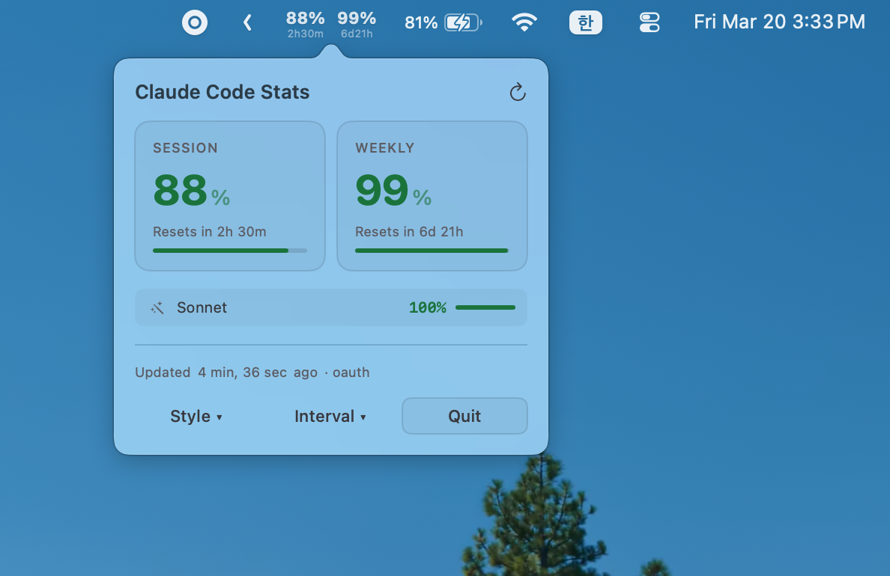

# Claude Code Stats

A macOS menu bar app for monitoring Claude Code usage in real-time.



## Menu Bar Display

Two display styles are supported:

**Compact** - Percentage + reset time (2 rows)
```
┌──────────────┐
│  95%   88%   │  ← Remaining usage
│ 4h31m 2d22h  │  ← Time until reset
└──────────────┘
```

**Inline** - Single line display
```
95%4h31m  88%2d22h
```

Warning colors are shown when usage is low: yellow below 30%, red below 15%.

## Popover

Click to view detailed usage for Session/Weekly/Sonnet with large number cards and progress bars.
Colors automatically adapt to light/dark mode.

## Features

- **Menu bar display** - View session and weekly remaining percentage + reset time at a glance
- **Style selection** - Switch between Compact / Inline
- **Detailed popover** - Progress bars & reset times for Session/Weekly/Sonnet
- **Auto refresh** - Configurable interval: 3min / 5min (default) / 10min
- **Dark/Light mode** - Automatic adaptation
- **Warning colors** - Yellow/red indicators when usage is low

## Data Source

**OAuth API** - Fetches from `api.anthropic.com/api/oauth/usage`

Token reading order:
1. Environment variable `CLAUDE_OAUTH_TOKEN`
2. `~/.claude/.stats-token-cache` (cached at build time)
3. `~/.claude/.credentials.json`

No direct keychain access, so no macOS permission popups.

## Requirements

- macOS 14.0 (Sonoma) or later
- [Claude Code CLI](https://docs.anthropic.com/en/docs/claude-code) installed and logged in
- Swift 5.9+

## Build & Run

```bash
./build.sh
open ClaudeCodeStats.app

# Install to Applications
cp -r ClaudeCodeStats.app /Applications/
```

## Architecture

```
Sources/ClaudeCodeStats/
├── main.swift              # App entry point (menu bar only, no Dock icon)
├── AppDelegate.swift       # NSStatusItem & menu bar rendering (Compact/Inline)
├── MenuBarView.swift       # SwiftUI popover (Design E, adaptive theme)
├── ClaudeUsageParser.swift # OAuth API fetching & parsing (no subprocess)
└── UsageStore.swift        # Observable state, auto-refresh, style settings
```

## License

MIT
